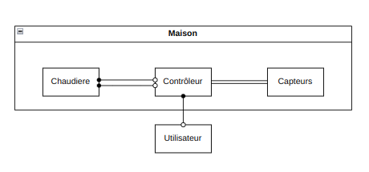

# Info 801 - Pilotage de la température dans une maison

# Conception
Les architectures utilisées :
- Composants - Connecteurs
- Pipes & Filters 

Pour cette applications, nous avons convenu de l'architecture suivante :

